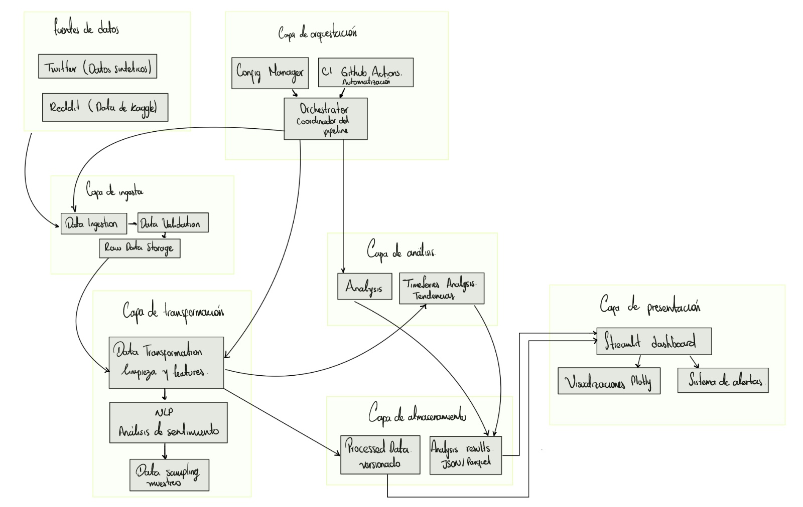
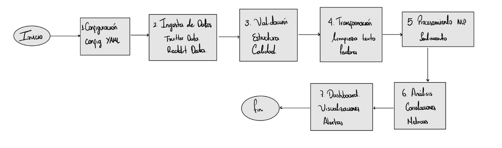
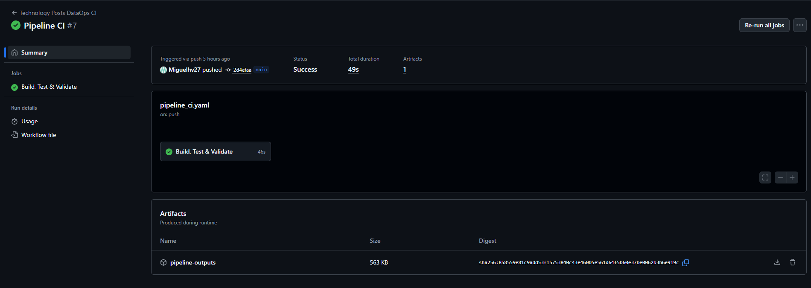

# Technology Posts Analytics Pipeline

### Proyecto Final Monitoreo de Tendencias Tecnológicas y Desempeño en Redes Sociales

Miguel Ángel Hernández Vargas. 

#### 1. Descripción General

Este proyecto desarrolla una arquitectura resiliente para analizar conversaciones tecnológicas en redes sociales, específicamente Twitter y Reddit. A diferencia de los enfoques tradicionales basados en datos estáticos, el sistema prioriza la automatización, la calidad continua y la gobernanza estadística. El pipeline combina datos históricos reales con simulaciones de flujo en tiempo real para generar información confiable sobre viralidad, sentimiento y tópicos de discusión, garantizando la integridad del dato desde la ingesta hasta la visualización.

# Objetivos

## Objetivo General

Diseñar e implementar un pipeline automatizado, versionado y observable que integre datos no estructurados de redes sociales, aplicando técnicas avanzadas de NLP y estadística inferencial para correlacionar métricas de actividad digital, asegurando la reproducibilidad y robustez del sistema mediante prácticas de CI.

## Objetivos Específicos

El proyecto se estructuró en cuatro ejes técnicos centrales:

- Automatización resiliente: construcción de un proceso de ingesta con capacidad de manejo ante fallas de conectividad o acceso.

- Rigor analítico: diseño de un motor estadístico capaz de seleccionar dinámicamente las pruebas adecuadas según la distribución real de los datos.

- Minería de texto avanzada: uso de VADER para análisis de sentimiento y LDA para descubrimiento no supervisado de tópicos.

- Observabilidad completa: elaboración de un dashboard interactivo con detección de anomalías en tiempo real a partir de desviaciones estándar.

# Diseño y Arquitectura

La solución se construyó bajo una arquitectura modular por capas, separando la adquisición de datos de la lógica analítica dentro de una estructura estándar de ingeniería de datos. El núcleo del procesamiento reside en el directorio src, que agrupa componentes especializados para cada fase del ciclo de vida del dato.

## Arquitectura General

El proceso inicia con un módulo de ingesta capaz de manejar conexiones híbridas mediante APIs o archivos locales. Los datos son enviados a un módulo de validación que verifica esquemas, reglas de negocio y consistencia estructural. Luego, un módulo de transformación unifica formatos, limpia ruido y normaliza los campos requeridos para análisis posteriores.

## Diagrama del Pipeline

El diagrama del pipeline muestra el recorrido completo del dato desde su configuración inicial hasta la visualización final. El proceso inicia con la carga de un archivo YAML que centraliza los parámetros del sistema y permite ejecutar el pipeline de forma reproducible. A partir de esta configuración, se procede a la ingesta de datos provenientes de Twitter (Sinteticos) y Reddit (Kaggle), donde el sistema obtiene publicaciones crudas que servirán como materia prima para el análisis.

Una vez extraídos, los datos atraviesan un paso de validación que revisa su estructura y calidad, filtrando inconsistencias antes de continuar. Luego pasan por una etapa de transformación en la que se limpia y preprocesa el texto, normalizando formatos y preparando las características necesarias para el análisis semántico.

Con los datos ya transformados, el módulo de NLP calcula el sentimiento y genera atributos lingüísticos que enriquecen el dataset. Estos resultados alimentan la fase analítica, donde se evalúan correlaciones y métricas clave que permitirán interpretar patrones de comportamiento en las conversaciones tecnológicas.

El flujo concluye en el dashboard, donde se presentan visualizaciones y alertas que sintetizan todo el procesamiento previo y permiten monitorear tendencias y anomalías de manera intuitiva.

# Metodología Aplicada

La metodología se diseñó con enfoque en resiliencia operativa e integridad analítica. Cada etapa del pipeline implementa técnicas orientadas a calidad continua.

## Ingesta Híbrida y con tolerancia a fallos

El pipeline emplea un patrón que prioriza la ingesta desde la API de Kaggle. Si ocurre un fallo por permisos o errores de red, se activa automáticamente un mecanismo de tolerancia a fallos que:

busca archivos locales previamente validados, o genera datos sintéticos basados en distribuciones Pareto y Log-Normal.

Esto garantiza continuidad operativa y compatibilidad con procesos de CI/CD.

## Transformación y Normalización

Se unificaron formatos heterogéneos, convirtiendo timestamps Unix (Reddit) e ISO-8601 (Twitter) a una escala temporal común. Adicionalmente, se aplicó imputación estadística conservadora en métricas de influencia con alta ausencia de datos, asumiendo que la falta de valor corresponde a ausencia de impacto, evitando introducir sesgos artificiales.

## Motor de Análisis Adaptativo

El sistema evalúa la distribución de las variables mediante pruebas de normalidad (D’Agostino K²). Cuando detecta distribuciones de cola larga las cuales son frecuentes en plataformas sociales selecciona automáticamente coeficientes no paramétricos (Spearman) en lugar de Pearson, asegurando conclusiones robustas y no afectadas por outliers.

## Visualización y Observabilidad

El dashboard en Streamlit ofrece monitoreo operativo con control estadístico, permitiendo detectar anomalías de volumen en tiempo real y alertando caídas críticas en el sentimiento agregado.

# Resultados Clave

El pipeline procesó más de 36.000 registros combinados, permitiendo obtener hallazgos significativos:

## Validación de Hipótesis

El coeficiente de Spearman mostró una correlación positiva pero débil entre longitud del texto y engagement (r = 0.255), evidenciando la preferencia por contenido breve. Asimismo, la relación entre influencia del autor y viralidad fue baja (r = 0.261), sugiriendo que en comunidades tecnológicas prevalece el contenido sobre la reputación.

## Minería de Texto

El modelo LDA reveló grupos temáticos principales:

- noticias de última hora y disrupción tecnológica,

- discusiones sobre productos de consumo masivo,

- debates sobre mercado laboral, entre otros.

- Comportamiento de la Red

La distribución del engagement confirmó una Ley de Potencia, donde el 99% de publicaciones tiene interacción mínima y solo una minoría en la cola larga concentra la viralidad. Esto valida la necesidad de técnicas no paramétricas y modelos estadísticos robustos.

# Pruebas Automatizadas y Logs

La calidad del sistema se garantizó con una suite de pruebas unitarias desarrolladas en pytest, que cubren los módulos críticos del pipeline: validación, limpieza, selección dinámica de pruebas estadísticas y orquestación. GitHub Actions ejecuta automáticamente las pruebas en cada push, promoviendo integridad continua.

El sistema produce logs estructurados para auditar la ejecución: inicio de ingesta, errores de la API, activación de mecanismos de respaldo, resultados del procesamiento y confirmación de guardado. Esto proporciona trazabilidad completa y permite diagnosticar si la ejecución usó datos reales o simulados.

Tras la ejecución de las pruebas unitarias, el flujo de integración continua quedó validado en GitHub Actions. La siguiente captura evidencia una ejecución exitosa del workflow, mostrando que el pipeline fue activado automáticamente con cada cambio en el repositorio, completó todas las etapas configuradas y generó los artefactos resultantes sin errores. Esta verificación visual respalda la confiabilidad operativa del sistema y confirma que los mecanismos de CI funcionan correctamente en el entorno remoto.

# Reflexión sobre Principios DataOps

El proyecto evidencia que DataOps es una filosofía operativa más que un conjunto de herramientas. Se priorizó:

- Resiliencia: el pipeline no falla ante indisponibilidad externa gracias a estrategias de self-healing.

- Calidad como código: reglas de validación y criterios estadísticos implementados directamente en el software.

- Observabilidad: monitoreo en tiempo real y detección automática de anomalías.

- Reproducibilidad: uso de configuración centralizada y control de versiones para replicar resultados en cualquier entorno.

# Instrucciones de Ejecución

Instalar las dependencias definidas en requirements.txt.

Ejecutar el script de generación de datos semilla para asegurar disponibilidad de mocks.

## Lanzar el pipeline principal con:

python run_pipeline.py

## Visualizar resultados mediante Streamlit:

python -m streamlit run dashboard/app.py
